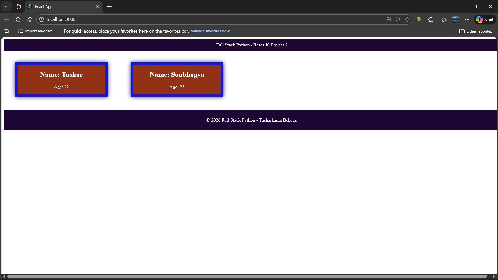

# Full Stack Python - React.JS Project 2

A React.js application demonstrating component-based architecture with student cards. This project showcases the use of class components, props, and modular component design.

## 🖼️ Project Screenshot



## 📋 Project Overview

This project displays student information cards using React components. It demonstrates:

- Component creation and reusability
- Props passing between components
- Class components in React
- CSS styling for modern UI design
- Modular component structure (Navbar, Footer, StudentCard)

## 🚀 Features

- **Navbar Component**: Displays the project title at the top
- **Student Card Component**: Reusable card component to display student information (name and age)
- **Footer Component**: Shows copyright information
- **Responsive Design**: Clean and modern UI with styled components
- **Props Implementation**: Dynamic data passing to components

## 🛠️ Technologies Used

- React.js
- JavaScript (ES6+)
- CSS3
- HTML5

## 📂 Project Structure

```
project2/
├── public/
│   ├── index.html
│   ├── manifest.json
│   └── robots.txt
├── src/
│   ├── Components/
│   │   ├── Navbar.js
│   │   ├── Footer.js
│   │   └── StudentCard.js
│   ├── App.js
│   ├── App.css
│   ├── index.js
│   └── index.css
├── screenshots/
│   └── output.png
├── package.json
└── README.md
```

## 🎯 Components Description

### Navbar Component

- Functional component displaying the project title
- Styled with dark purple background

### StudentCard Component

- Class-based component accepting `name` and `age` as props
- Displays student information in a styled card format
- Reusable for multiple student entries

### Footer Component

- Functional component showing copyright information
- Consistent styling with the navbar

## 💻 Installation & Setup

1. Clone the repository:

```bash
git clone https://github.com/tusharkanta-behera/react-project2
cd project2
```

2. Install dependencies:

```bash
npm install
```

3. Start the development server:

```bash
npm start
```

4. Open [http://localhost:3000](http://localhost:3000) to view it in your browser.

## 📝 Available Scripts

### `npm start`

Runs the app in the development mode.\
Open [http://localhost:3000](http://localhost:3000) to view it in your browser.

The page will reload when you make changes.\
You may also see any lint errors in the console.

### `npm test`

Launches the test runner in the interactive watch mode.

### `npm run build`

Builds the app for production to the `build` folder.\
It correctly bundles React in production mode and optimizes the build for the best performance.

## 🎨 Styling

The application uses custom CSS with:

- Dark purple theme (#1e0734) for navbar and footer
- Brown background (#a0522d) for student cards
- Blue borders for card styling
- Centered layouts with flexbox

## 👨‍💻 Author

**Tusharkanta Behera**

© 2026 Full Stack Python

## 📚 Learn More

You can learn more in the [Create React App documentation](https://facebook.github.io/create-react-app/docs/getting-started).

To learn React, check out the [React documentation](https://reactjs.org/).

### Code Splitting

This section has moved here: [https://facebook.github.io/create-react-app/docs/code-splitting](https://facebook.github.io/create-react-app/docs/code-splitting)

### Analyzing the Bundle Size

This section has moved here: [https://facebook.github.io/create-react-app/docs/analyzing-the-bundle-size](https://facebook.github.io/create-react-app/docs/analyzing-the-bundle-size)

### Making a Progressive Web App

This section has moved here: [https://facebook.github.io/create-react-app/docs/making-a-progressive-web-app](https://facebook.github.io/create-react-app/docs/making-a-progressive-web-app)

### Advanced Configuration

This section has moved here: [https://facebook.github.io/create-react-app/docs/advanced-configuration](https://facebook.github.io/create-react-app/docs/advanced-configuration)

### Deployment

This section has moved here: [https://facebook.github.io/create-react-app/docs/deployment](https://facebook.github.io/create-react-app/docs/deployment)

### `npm run build` fails to minify

This section has moved here: [https://facebook.github.io/create-react-app/docs/troubleshooting#npm-run-build-fails-to-minify](https://facebook.github.io/create-react-app/docs/troubleshooting#npm-run-build-fails-to-minify)

# r e a c t  -  P r o j e c t  2
